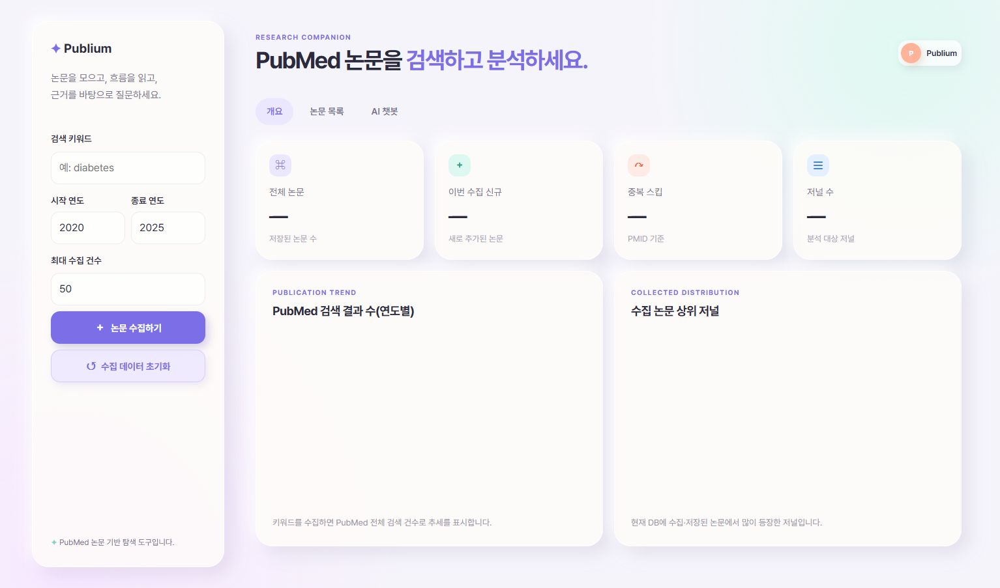

# Publium

PubMed 논문을 수집하고 연구 흐름을 분석하며, 저장된 논문을 근거로 AI와 대화할 수 있는 연구 보조 웹 애플리케이션입니다.

> **Live Demo:** [https://publium.onrender.com](https://publium.onrender.com/)
>
> Render 무료 인스턴스는 15분 동안 요청이 없으면 절전 상태가 됩니다. 첫 접속에는 수십 초가 걸릴 수 있습니다.



## 주요 기능

- **PubMed 논문 수집** — 키워드, 연도 범위, 최대 수집 건수를 지정해 논문 메타데이터를 가져옵니다.
- **중복 방지** — PMID를 기준으로 동일한 논문이 중복 저장되지 않도록 처리합니다.
- **연구 동향 분석** — 연도별 PubMed 검색 건수와 수집 논문의 상위 저널을 시각화합니다.
- **논문 목록 검색** — 제목, 초록, 수집 키워드, 연도, 저널 조건으로 논문을 찾을 수 있습니다.
- **초록 확인 및 CSV 다운로드** — 초록이 없는 논문도 목록에 유지하며, 현재 검색 결과를 CSV로 내려받을 수 있습니다.
- **논문 기반 AI 챗봇** — 저장된 논문을 근거로 답변하고 관련 PMID를 함께 제시합니다.
- **사용자별 연구 공간** — Google 로그인 계정별로 수집 논문, 검색 키워드, 분석 추세, 채팅 기록을 분리해 저장합니다.

## 기술 스택

| 영역 | 기술 |
| --- | --- |
| Backend | Python, FastAPI, Uvicorn |
| Frontend | Jinja2, HTML, CSS, Vanilla JavaScript |
| Database | SQLite(로컬), Supabase PostgreSQL(배포) |
| External API | NCBI PubMed ESearch / EFetch |
| AI | LangChain, OpenAI |
| Authentication | Authlib, Google OAuth 2.0 |
| Deployment | Render Web Service, Supabase |

## 서비스 구조

```text
Browser
  └─ Render · FastAPI
       ├─ PubMed API
       ├─ OpenAI API
       ├─ Google OAuth
       └─ Supabase PostgreSQL
```

```text
team-pubmed/
├─ core/
│  ├─ analysis.py          # 연도별·저널별 통계
│  ├─ database.py          # SQLite/PostgreSQL 연결
│  ├─ db.py                # 사용자별 논문 저장·검색
│  └─ pubmed.py            # PubMed 수집
├─ services/
│  ├─ chatbot.py           # 논문 기반 AI 답변
│  ├─ chat_store.py        # 사용자별 채팅 기록
│  └─ guard.py             # 의료 조언 요청 차단
├─ static/                 # CSS, JavaScript
├─ templates/              # 랜딩·대시보드 템플릿
├─ tests/                  # 단위·통합 테스트
├─ auth.py                 # Google OAuth
├─ main.py                 # FastAPI 앱과 API
└─ render.yaml             # Render Blueprint
```

## 로컬 실행

### Git Bash

```bash
python -m venv .venv
source .venv/Scripts/activate
python -m pip install -r requirements.txt
cp .env.example .env
uvicorn main:app --reload
```

브라우저에서 [http://127.0.0.1:8000](http://127.0.0.1:8000)으로 접속합니다.

서버를 종료하려면 실행 중인 터미널에서 `Ctrl + C`를 누릅니다.

## 환경 변수

`.env.example`을 `.env`로 복사한 다음 필요한 값을 설정합니다.

| 변수 | 필수 여부 | 설명 |
| --- | --- | --- |
| `OPENAI_API_KEY` | AI 기능 사용 시 필수 | OpenAI API 키 |
| `GOOGLE_CLIENT_ID` | 로그인 사용 시 필수 | Google OAuth 클라이언트 ID |
| `GOOGLE_CLIENT_SECRET` | 로그인 사용 시 필수 | Google OAuth 클라이언트 보안 비밀 |
| `SESSION_SECRET` | 필수 | 세션 쿠키 서명용 임의 문자열 |
| `DATABASE_URL` | 배포 시 필수 | Supabase Session Pooler 연결 문자열 |
| `PUBMED_DB_PATH` | 선택 | 로컬 SQLite 파일 경로, 기본값 `pubmed.db` |
| `NCBI_API_KEY` | 선택 | PubMed 요청 한도 향상용 API 키 |
| `NCBI_EMAIL` | 선택 | NCBI 요청 식별용 이메일 |
| `HTTPS_ONLY` | 배포 시 권장 | HTTPS 환경에서는 `true` |

`.env` 파일과 모든 비밀키는 Git에 커밋하지 않습니다.

## Google OAuth 설정

Google Cloud Console의 OAuth 클라이언트에 다음 승인된 리디렉션 URI를 등록합니다.

```text
# 로컬
http://127.0.0.1:8000/auth/callback

# 배포
https://publium.onrender.com/auth/callback
```

`localhost`로 접속할 경우 아래 URI도 별도로 등록해야 합니다.

```text
http://localhost:8000/auth/callback
```

## API

| Method | Endpoint | 설명 |
| --- | --- | --- |
| `GET` | `/health` | 배포 상태 확인 |
| `POST` | `/api/collect` | PubMed 논문 수집 |
| `GET` | `/api/stats` | 저장 논문·저널 통계 |
| `GET` | `/api/trend` | 키워드별 연도 추세 |
| `GET` | `/api/papers` | 조건별 논문 검색 |
| `GET` | `/api/metadata` | 수집 논문 목록 |
| `POST` | `/api/papers/reset` | 수집 데이터 초기화 |
| `POST` | `/api/chat/stream` | AI 답변 SSE 스트리밍 |
| `GET` | `/api/chat/history` | 사용자 채팅 기록 |
| `DELETE` | `/api/chat/history` | 현재 사용자의 대화 기록 삭제 |

## 테스트

```bash
python -m unittest discover -s tests -v
```

테스트는 PubMed 응답 파싱, SQLite/PostgreSQL 연결, 사용자별 논문 격리, 논문 검색·중복 처리, 통계, OAuth 접근 제어, 사용자별 채팅 기록, 의료 조언 차단을 검증합니다.

## 배포

현재 운영 환경은 다음과 같이 구성되어 있습니다.

- **Render 무료 Web Service** — FastAPI 애플리케이션
- **Supabase 무료 PostgreSQL** — 사용자별 논문 수집 목록 및 채팅 데이터
- **Render Blueprint** — 저장소 루트의 `render.yaml`

Render 환경 변수의 `DATABASE_URL`에는 Supabase의 **Session Pooler(포트 5432)** 연결 문자열을 사용합니다. 배포 후 Google OAuth 클라이언트에도 운영 리디렉션 URI를 추가해야 합니다.

사용자별 저장 구조로 업데이트하면 기존 공용 논문은 어느 계정에도 자동 귀속되지 않습니다. 각 사용자는 로그인 후 필요한 논문을 새로 수집합니다.

## 주의사항

Publium은 논문 탐색과 연구 보조를 위한 서비스입니다. 의료 전문가의 진단을 대신하지 않으며, AI 답변은 반드시 원문 논문을 통해 다시 확인해야 합니다.
